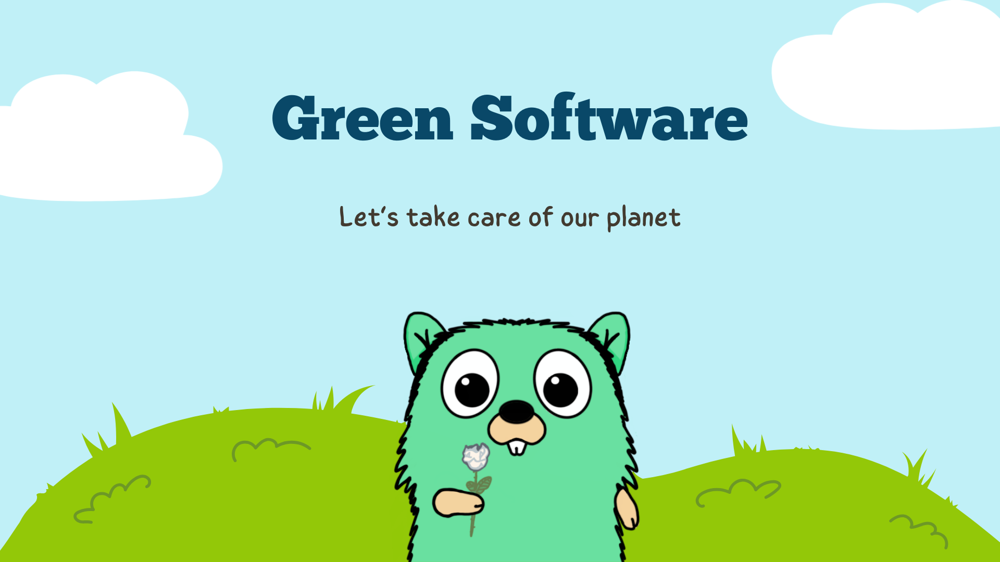

# Awesome Go-Green 🌳

    

Collection of practices and examples on doing green development using go and tools to reduce carbon 💨 footprint 👣.

Enjoying our collection of tools for green development 🌱? Show your support by starring ⭐ or forking 🍴!

- [Awesome Go-Green 🌳](#awesome-go-green-)
  - [Software 💻](#software-)
    - [Coding Practices 🛠️](#coding-practices-️)
    - [Tools 🧰](#tools-)
  - [ML \& AI 🤖](#ml--ai-)
  - [Infrastructure 🏗️](#infrastructure-️)
    - [Cloud ☁️](#cloud-️)
    - [Kubernetes ☸️](#kubernetes-️)
    - [Hosting 🌐](#hosting-)
  - [Resources 📘](#resources-)
    - [Trainings 👩‍🏫](#trainings-)
    - [Books 📚](#books-)
    - [Podcasts 🎙️](#podcasts-️)
    - [Groups 👥](#groups-)
    - [Helpful Links 🔗](#helpful-links-)
  - [Events 🎊](#events-)
    - [World Earth Day 🌎](#world-earth-day-)
  - [Contributors 🤝](#contributors-)
  - [Community and Support 💬](#community-and-support-)
  - [Adopters 🧑‍🤝‍🧑](#adopters-)
  - [Thank you ❤️](#thank-you-️)

## Software 💻

### Coding Practices 🛠️

### Tools 🧰

| Project     | Description      | Usage or Example |
| ------- | ----------- | ---------------- |
| [PowerLetrics](https://github.com/green-kernel/powerletrics) | A tool to see what process is using how much resources on Linux | [README.md](./software/tools/powerletrics/README.md) |

## ML & AI 🤖

| Project     | Description      | Usage or Example |
| ------- | ----------- | ---------------- |
|[pruna](https://github.com/PrunaAI/pruna)| An AI inference optimization framework.| [README.md](./ml-ai/pruna/README.md) |

## Infrastructure 🏗️

### Cloud ☁️

| Project     | Description      | Usage or Example |
| ------- | ----------- | ---------------- |
|[Teads Engineering](https://engineering.teads.com/sustainability/carbon-footprint-estimator-for-aws-instances/)| Carbon footprint estimator for AWS instances| [README.md](./infrastructure/cloud/teads-engineering/README.md) |
|[aether.green](https://aether.green/) | An open telemetry exporter to calculate the carbon emissions generated by your cloud infrastructure | [README.md](./infrastructure/cloud/aether/README.md) |

### Kubernetes ☸️

| Project     | Description      | Usage or Example |
| ------- | ----------- | ---------------- |
| [kube-green](https://kube-green.dev/) | An operator to reduce CO2 footprint of your clusters | [README.md](./infrastructure/kubernetes/kube-green/README.md) |
|[kepler](https://sustainable-computing.io/)| Kepler (Kubernetes-based Efficient Power Level Exporter) is a Prometheus exporter.| [README.md](./infrastructure/kubernetes/kepler/README.md) |

### Hosting 🌐

| Project     | Description      | Usage or Example |
| ------- | ----------- | ---------------- |
| [Green Web Foundation Directory](https://app.greenweb.org/directory/) | The directory contains listing of verified green hosting providers in world | [README.md](./infrastructure/hosting/green-web-directory/README.md) |

## Resources 📘

### Trainings 👩‍🏫

| Name | Cost | Usage or Example |
| ------- | ----------- | ---------------- |
| [Green Software for Practitioners (LFC131)](https://training.linuxfoundation.org/training/green-software-for-practitioners-lfc131/) | Free | [README.md](./resources/trainings/lfc-131/README.md) |
| [Sustainable IT for Beginners](https://tcocertified.com/sustainable-it-for-beginners/) | Free | [README.md](./resources/trainings/sustainable-it-for-beginners/README.md) |

### Books 📚

| Name | Cost | Usage or Example |
| ------- | ----------- | ---------------- |
| [Building Green Software](https://www.amazon.co.uk/Building-Green-Software-Sustainable-Development/dp/1098150627) | Paid | [README.md](./resources/books/building-green-software/README.md) |

### Podcasts 🎙️

| Name | Host | Details |
| ------- | ----------- | ---------------- |
| [Environment Variables](https://podcast.greensoftware.foundation/) | The Green Software Foundation | [README.md](./resources/podcasts/environment-variables/README.md) |
| [Green IT on a Cloud](https://open.spotify.com/show/1oSqlKOSOf9W4cELSoUewS) | Rob Gillam | [README.md](./resources/podcasts/green-it-on-cloud/README.md) |

### Groups 👥

| Name | Membership | Details |
| ------- | ----------- | ---------------- |
| [TAG Environmental Sustainability](https://tag-env-sustainability.cncf.io/) | Public | [README.md](./resources/groups/tag-environmental-sustainability/README.md) |
| [Green Software Ireland](https://www.meetup.com/green_software_ireland/) | Public | [README.md](./resources/groups/green-software-ireland/README.md) |

### Helpful Links 🔗

| Name | Description | Usage or Example  |
| ------- | ----------- | ---------------- |
| [Electricity Maps](https://app.electricitymaps.com/map) | Climate Impact by Area | [README.md](./resources/helpful-links/electricity-maps/README.md) |

## Events 🎊

### World Earth Day 🌎

| Name | Date | Usage or Example |
| ------- | ----------- | ---------------- |
| [Earth Day](https://en.wikipedia.org/wiki/Earth_Day) | 22nd April | [README.md](./events/world-earth-day/README.md) |

## Contributors 🤝

Big thanks to our contributors.

Made with [contrib.rocks](https://contrib.rocks).

Kindly refer to the [contributing guide](https://github.com/sarvsav/awesome-go-green/blob/main/CONTRIBUTING.md) to contribute to the project.

## Community and Support 💬

Stay connected with our community and stay updated with the latest developments:

- **Join us on Discord**: Click the badge below to join our community on Discord where you can ask questions, share ideas, and get support from other users and the development team.
  

- **Watch the repository**: Click the "Watch" button on the top right of this repository to get notified about the latest updates.
  

## Adopters 🧑‍🤝‍🧑

📢 If you're using green 🌳 practices in your organization, please add your company name to [this list](./ADOPTERS.md).

By adding yourself to the [ADOPTERS.md](./ADOPTERS.md) file, you help increase the project's visibility and credibility, which is essential for its growth.

## Thank you ❤️

Thank you for taking the step towards the green development 🌍.
