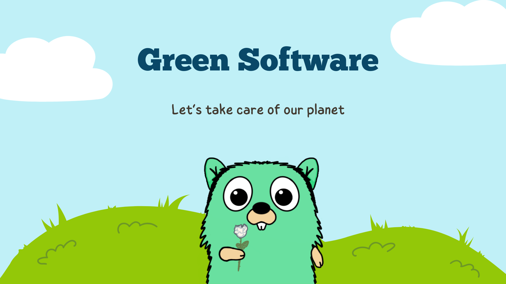

# Awesome Go-Green 🌳

    

Collection of practices and examples on doing green development using go and tools to reduce carbon 💨 footprint 👣.

Enjoying our collection of tools for green development 🌱? Show your support by starring ⭐ or forking 🍴!

- [Awesome Go-Green 🌳](#awesome-go-green-)
  - [Software](#software)
  - [Infrastructure](#infrastructure)
    - [Kubernetes](#kubernetes)

## Software

## Infrastructure

### Kubernetes

| Project     | Description      | Usage or Example |
| ------- | ----------- | ---------------- |
| [kube-green](https://kube-green.dev/) | An operator to reduce CO2 footprint of your clusters | [README.md](./infrastructure/kubernetes/kube-green/README.md) |

