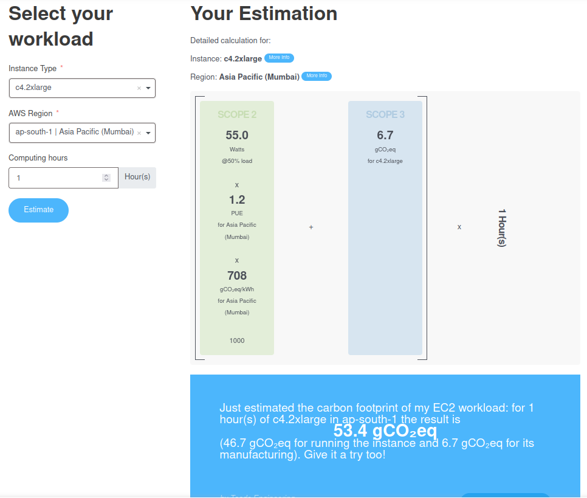

# Teads Engineering

We are building a platform for sustainable advertising, helping the best Publishers in the world monetize their content and connecting Advertisers to nearly 2 billion people every month in a respectful way.

## About

Curious about the power consumption and carbon footprint of an EC2 instance? As part of the first Measure challenge, get an estimation below. This initiative is still a work in progress, data is provided as-is for open contribution purposes and without warranty.

## How to use?

Go to website: [Carbon footprint estimator for AWS instances](https://engineering.teads.com/sustainability/carbon-footprint-estimator-for-aws-instances/#calculator)

Fill the required values, and click on calculate. Below is an example,



The Teads Unofficial plugin can also be integrated with Impact Framework, and can be found [HERE](https://github.com/Green-Software-Foundation/if-unofficial-plugins).

On how to use impact framework teads aws plugin, refer this [Guide](https://github.com/Green-Software-Foundation/if-unofficial-plugins/blob/main/src/lib/teads-aws/README.md).

Example manifest looks like this:

```yaml
name: teads-aws
description: simple demo invoking TeadsAWS plugin
tags:
initialize:
  plugins:
    teads-aws:
      method: TeadsAWS
      path: '@grnsft/if-unofficial-plugins'
      global-config:
        interpolation: linear
tree:
  children:
    child:
      pipeline:
        - teads-aws # duration & config -> embodied
      defaults:
        cloud/instance-type: m5n.large
        interpolation: linear
        cpu/expected-lifespan: 252288000
      inputs:
        - timestamp: 2023-07-06T00:00
          duration: 3600
          cpu/utilization: 10
```

Thanks to `Tixserve` for providing this [manifest file](./assets/manifests/tixserve-ticketjourney-rds-cpu-may24.yaml). Source: [GitHub Repo](https://github.com/Green-Software-Ireland/measure-tixserve-carbon)

## Links

Detailed explanation can be found on [Medium](https://medium.com/teads-engineering/building-an-aws-ec2-carbon-emissions-dataset-3f0fd76c98ac)

## Thank you

Thank you for taking the step towards the green development 🌍.
