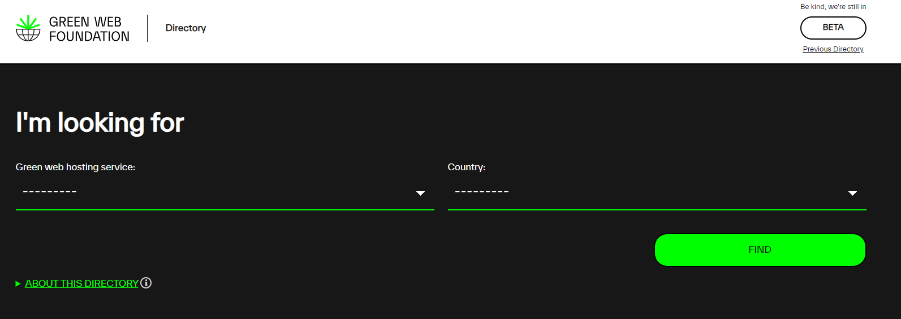
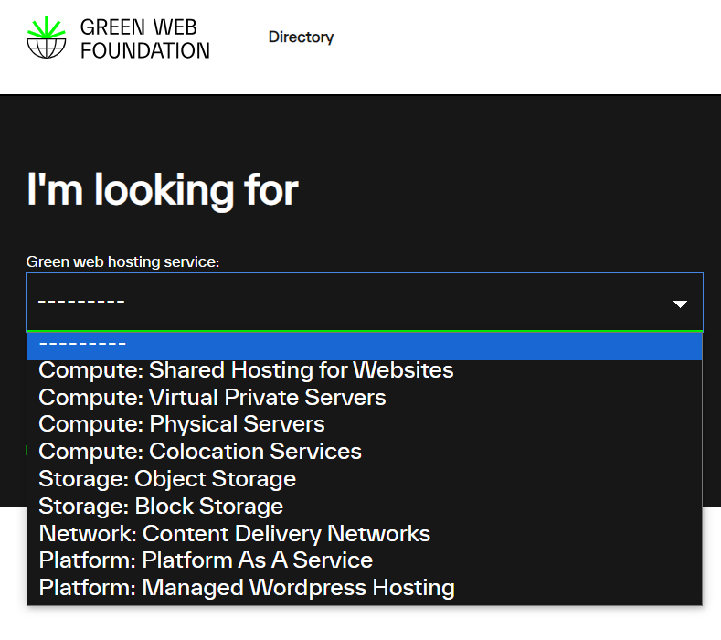
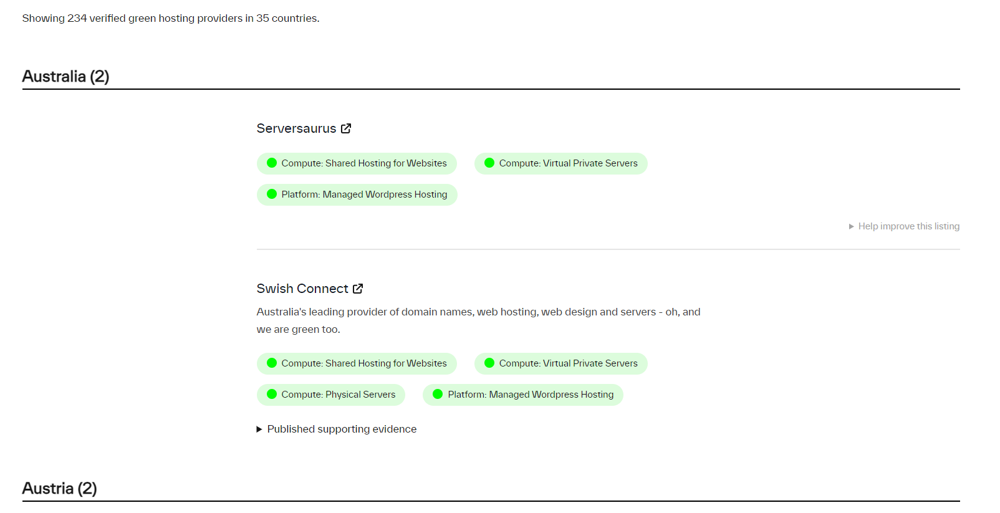

# Green Web Directory

The [Green Web Foundation](https://www.thegreenwebfoundation.org/) has a directory that has a  listing of verified green hosting providers in world.

## Green WebHosting services

The [Green-Web-Foundation](https://app.greenweb.org/directory/) lists down the available service providers present in your country that uses green energy to host their services or use the services from green providers.
It will be good to choose the closest service provider to your clients to reduce the network transmission.
The listing provides the URL of service provider and services provided by them. It also contains the supporting evidence of their green resource.

## How to use the service?

Go to [green-web-foundation-directory](https://app.greenweb.org/directory/).

Choose your webhosting service based on your need.

And, next is to select the country closest to you and your clients, and it will list down the service providers with details.

## Usage of badge

If you are using services from any of the service provider from the listing, then feel proud to use the green hosting badge on your website.

## Thank you

Thank you for contributing towards the green development 🌍.