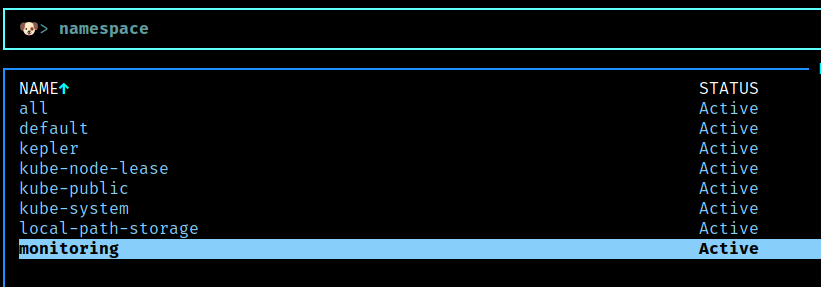
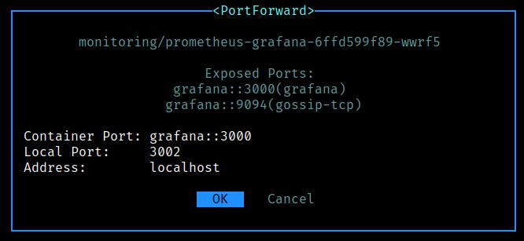
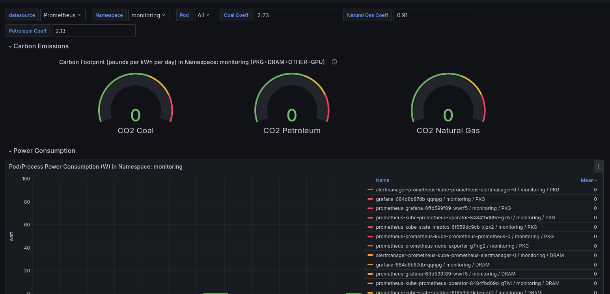

# Kepler (Kubernetes-based Efficient Power Level Exporter)

Kepler (Kubernetes-based Efficient Power Level Exporter) is a Prometheus exporter. It uses eBPF to probe CPU performance counters and Linux kernel tracepoints.

These data and stats from cgroup and sysfs can then be fed into ML models to estimate energy consumption by Pods.

## Setting local kubernetes cluster

1. Set up `Kind` cluster.

```bash
kind create cluster --config=./01-setup-cluster/01-local-cluster-config.yml
```

2. Update the context to use freshly created cluster. (kind does automatically switch context)

```bash
kubectl config use-context kind-kepler-demo-local-cluster
kubectl cluster-info --context kind-kepler-demo-local-cluster
```

## Deploying prometheus using helm chart

1. Setting up Prometheus and Grafana using `kube-prometheus-stack`.

```bash
helm repo add prometheus-community https://prometheus-community.github.io/helm-charts
helm repo update

helm install prometheus prometheus-community/kube-prometheus-stack \
    --namespace monitoring \
    --create-namespace \
    --wait
```

2. Verify the resources.

```bash
kubectl --namespace monitoring get pods -l "release=prometheus"
#NAME                                                   READY   STATUS    RESTARTS   AGE
#prometheus-kube-prometheus-operator-8484fbd69d-g7lvl   1/1     Running   0          4m3s
#prometheus-kube-state-metrics-6f659dc9cb-xjzx2         1/1     Running   0          4m3s
#prometheus-prometheus-node-exporter-g7mg2              1/1     Running   0          4m3s
```

3. And, we have alert manager as well as [grafana](https://grafana.com/) also running.

```bash
kubectl --namespace monitoring get pods
NAME                                                     READY   STATUS    RESTARTS   AGE
alertmanager-prometheus-kube-prometheus-alertmanager-0   2/2     Running   0          14h
prometheus-grafana-6ffd599f89-wwrf5                      3/3     Running   0          14h
prometheus-kube-prometheus-operator-8484fbd69d-g7lvl     1/1     Running   0          14h
prometheus-kube-state-metrics-6f659dc9cb-xjzx2           1/1     Running   0          14h
prometheus-prometheus-kube-prometheus-prometheus-0       2/2     Running   0          14h
prometheus-prometheus-node-exporter-g7mg2                1/1     Running   0          14h
```

4. Doing port forward for grafana to access the dashboard.

It's easier to configure using [k9s](https://k9scli.io/). Start the utility and type `namespace` to list all namespaces and choose `monitoring`.



Choose the pod with `prometheus-grafana-*` and press `shift-f` for port forwarding.



I have used port `3002` as the port 3000 in my machine is already occupied by different service.

5. Access the grafana dashboard on url: [Grafana local](http://localhost:3002/) and use the credentials: username as `admin` and password as `prom-operator`.

## Deploying kepler using helm chart

1. Setting up kepler repo and installing latest version.

```bash
helm repo add kepler https://sustainable-computing-io.github.io/kepler-helm-chart
helm repo update
```

2. Find the latest version of the kepler.

```bash
helm search repo kepler
```

3. Make a dry run.

```bash
helm install kepler kepler/kepler --namespace kepler --create-namespace --dry-run --devel
```

4. Deploy kepler

```bash
helm install kepler kepler/kepler \
    --namespace kepler \
    --create-namespace \
    --set serviceMonitor.enabled=true \
    --set serviceMonitor.labels.release=prometheus
```

5. Verify the installation

```bash
KPLR_POD=$(
    kubectl get pod \
        -l app.kubernetes.io/name=kepler \
        -o jsonpath="{.items[0].metadata.name}" \
        -n kepler
)
kubectl wait --for=condition=Ready pod $KPLR_POD --timeout=-1s -n kepler
```

## Accessing the Kepler Exporter dashboard

As there is no load and consumption, hence the load will almost equivalent to zero. Go to `Dashboard` and click on `new` and choose `Import`. With import option, we can add predefined `JSON` files from the [kepler github repo](https://github.com/sustainable-computing-io/kepler/tree/f97a4487af022639f3cde41d8f7efb822fc6c5b0/grafana-dashboards). The json files also present in folder [03-grafana-dashboard](./03-grafana-dashboard).

And, then simply upload the JSON files, and access it.



## How does it help?

With help of the dashboard you can monitor the resources, and can optimize the usage.

## How to unistall?

1. List all the deployments.

```bash
$ helm list --all-namespaces | awk '{print $1, $2}'
NAME            NAMESPACE
kepler          kepler
prometheus      monitoring
```

2. Uninstall the deployment.

```bash
$ helm uninstall kepler --namespace kepler
release "kepler" uninstalled

$ helm uninstall prometheus --namespace monitoring
release "prometheus" uninstalled
```

## Thank you

Thank you for contributing towards the green development 🌍.
