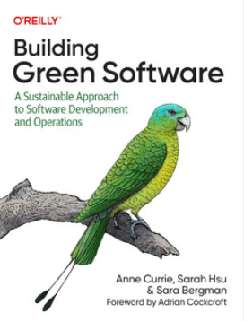

# Building Green Software

Building Green Software: A Sustainable Approach to Software Development and Operations

## Cover

## Authors

- by Anne Currie (Author)
- Sarah Hsu (Author)
- Sara Bergman (Author)

## Book description

How will software development and operations have to change to meet the sustainability and green needs of the planet? And what does that imply for development organizations? In this eye-opening book, sustainable software advocates Anne Currie, Sarah Hsu, and Sara Bergman provide a unique overview of this topic—discussing everything from the likely evolution of national grids to the effect those changes will have on the day-to-day lives of developers.

Ideal for everyone from new developers to CTOs, Building Green Software tackles the challenges involved and shows you how to build, host, and operate code in a way that's not only better for the planet but also cheaper and relatively low-risk for your business. Most hyperscale public cloud providers have already committed to net-zero IT operations by 2030. This book shows you how to get on board.

### You'll explore

- How the energy transition is likely to change hosting on prem and in the cloud—and how your company can prepare.
- The fundamental architectural principles of sustainable software development and how to apply them.
- How to determine which parts of your system need to change.
- The concept of extending hardware longevity and the part that software plays.

## Source

[O'reilly - Building Green Software](https://www.oreilly.com/library/view/building-green-software/9781098150617/)

## Thank you

Thank you for contributing towards the green development 🌍.
