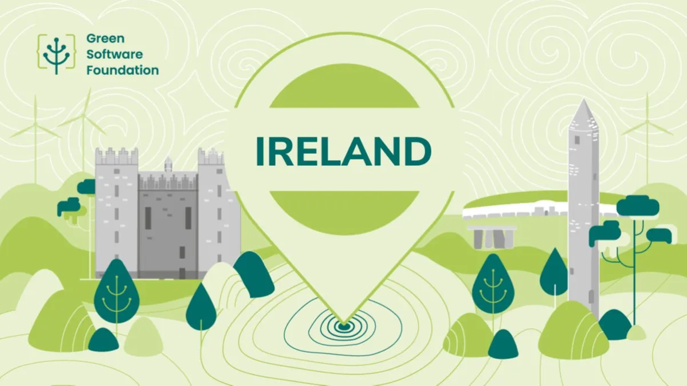

# Green Software Ireland

**Organizer**: [John Behan](https://www.meetup.com/members/129541712/)
**Group**: [Link to meetup group](https://www.meetup.com/green_software_ireland/)

## About

Green Software Ireland is a community of software developers in Ireland passionate about building sustainable and environmentally-friendly software.

Our group's mission is to empower our community with the tools and knowledge needed to build sustainable and carbon aware software solutions.

We have regular meetups which are announced here. These meetups are part sponsored by the Green Software Foundation. The Green Software Foundation is a non-profit aiming to create a trusted ecosystem of people, standards, tooling and best practices for green software.

We look forward to seeing you at our next event!

Sponsored by: [Green Software Foundation](https://greensoftware.foundation/)

## Group Resources

- [LinkedIn Community](https://www.meetup.com/green_software_ireland/)
- [GitHub Organization](https://github.com/Green-Software-Ireland)

## Thank you

Thank you for taking the step towards the green development 🌍.
