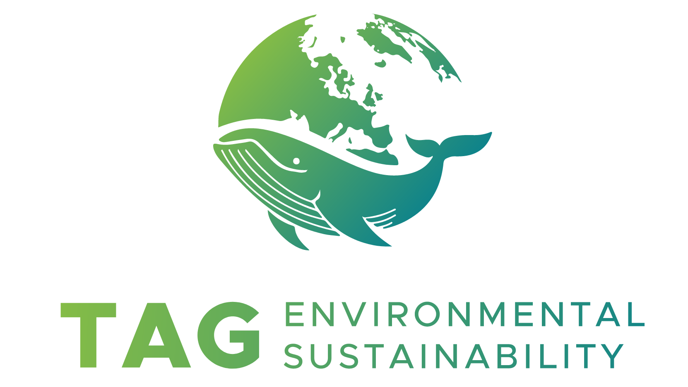

# TAG Environmental Sustainability

Source: [TAG Environmental Sustainability](https://tag-env-sustainability.cncf.io/)

## About

TAG Environmental Sustainability supports projects and initiatives related to delivering cloud-native applications, including building, packaging, deploying, managing, and operating them.

## Goal

This Technical Advisory Group’s goal is to advocate for, develop, support, and help evaluate environmental sustainability initiatives in cloud native technologies. This TAG will identify values and possible incentives for service providers to reduce their consumption and carbon footprint through cloud native tooling.

## Links

[Agenda and Notes](https://docs.google.com/document/d/1TkmMyXJABC66NfYmivnh7z8Y_vpq9f9foaOuDVQS_Lo/edit)
[YouTube Channel](https://www.youtube.com/@CNCFEnvTAG/playlists)
[GitHub Repository](https://github.com/cncf/tag-env-sustainability)
[Zoom Meeting](https://zoom.us/my/cncftagenvsustainability) (Passcode: 77777)

## Leads

- [Leonard Pahlke](https://github.com/leonardpahlke) (Chair)
- [Marlow Weston](https://github.com/catblade) (Chair)
- [Max Körbächer](https://github.com/mkorbi) (Chair)
- [Kristina Devochko](https://github.com/guidemetothemoon) (TL)
- [Saiyam Pathak](https://github.com/saiyam1814) (TL)

## Thank you

Thank you for take one step towards the green development 🌍.
