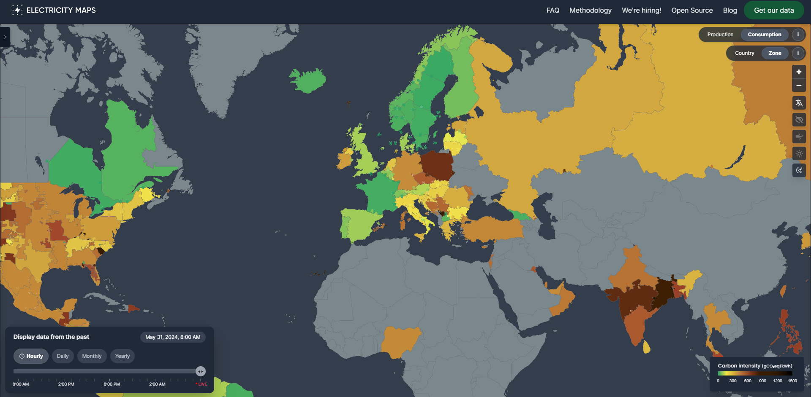

# Electricity Maps

Source: [Electricity Maps](https://app.electricitymaps.com/map)

## Climate Impact by Area

Ranked by carbon intensity of electricity consumed (gCO₂eq/kWh)

## Introduction

Electricity Maps' mission is to organize the world's electricity data to drive the transition towards a truly decarbonized electricity system. They provide carbon intensity data coming from electricity consumption for more than 200 zones in the world.

To do that, they follow state-of-the-art approaches to collect data from official sources. When data is missing, they use a variety of techniques to estimate it. Later, they run their flow-tracing pipeline to determine how electricity (and its carbon intensity) flows between countries. This allows them to provide carbon intensity information for both production and consumption for each country. Their methodology follows these steps:

- Collecting data - Their data sources (how they verify and collect their data)
- How missing data is handled - Their estimation models
- Computing CO2 emissions - Carbon intensity and emission factors
- Data processing from collection to carbon intensity calculation

You can read more about their methodology [here](https://www.electricitymaps.com/methodology).

## About them

> The app is developed and maintained by Electricity Maps, a Danish startup company. Our mission is to organise the world's electricity data to drive the transition towards a truly decarbonised electricity system.

## Contribute

> Yes! The app is an open-source project, made possible by our volunteer contributors. If you want to help develop the map, either by adding data sources for new areas, adding new features or fixing bugs, feel free to join us in our [GitHub](https://github.com/electricityMaps/electricitymaps-contrib/).

## Blog

You can access the blog [here](https://www.electricitymaps.com/blog?utm_source=app.electricitymaps.com&utm_medium=referral).

## Thank you

Thank you for taking the step towards the green development 🌍.
