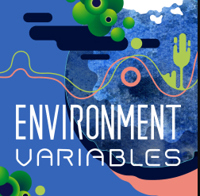

# Environment Variables

Each episode we discuss the latest news regarding how to reduce the emissions of software and how the industry is dealing with its own environmental impact. Brought to you by The Green Software Foundation.

Source: [Environment Variables Podcast](https://podcast.greensoftware.foundation/)

## Host

The Green Software Foundation

## Available on

- [Apple Podcasts](https://podcasts.apple.com/us/podcast/environment-variables/id1618265745)
- [Google Podcasts](https://podcasts.google.com/feed/aHR0cHM6Ly9mZWVkcy5iY2FzdC5mbS9lbnZpcm9ubWVudC12YXJpYWJsZXM=)
- [Spotify](https://open.spotify.com/show/4gynCMPIRC49vcO0hA8PGi)
- [Podcast Addict](https://podcastaddict.com/podcast/)
- [PlayerFM](https://player.fm/series/series-3336430)
- [Listen Notes](https://www.listennotes.com/podcasts/environment-variables-green-software-Ou6p1TPox4r/)
- [Podcast Index](https://podcastindex.org/podcast/5317031)
- [Deezer](https://deezer.com/show/3581217)
- [Castro](https://castro.fm/itunes/1618265745)
- [Overcast](https://castro.fm/itunes/1618265745)
- [Pocket Casts](https://pca.st/itunes/1618265745)

## Thank you

Thank you for taking the step towards the green development 🌍.
